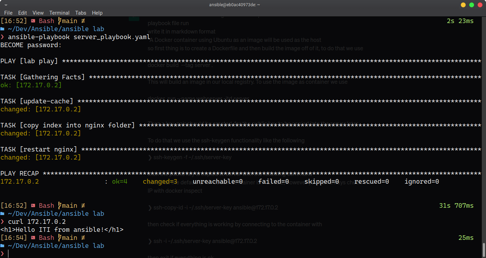

# Ansible Playbook File Run Documentation

This documentation outlines the steps to run an Ansible playbook file using a Docker container as the host.

## Docker Container Setup

- Create a Dockerfile for an Ubuntu image as the host.
- Build the image using the following command: `docker build --tag server .`
- Run the image as a container using the following command: `docker run --name webserver -itd server`
- Generate a key-pair using `ssh-keygen -f ~/.ssh/server-key` for the public key to be copied to the server later.
- Copy the public key to the server using `ssh-copy-id -i ~/.ssh/server-key ansible@172.17.0.2`. Note that the default IP address for the Docker container is `172.17.0.2`, but you can always check the IP address using `docker inspect`.
- Check if everything is working by connecting to the container using `ssh -i ~/.ssh/server-key ansible@172.17.0.2`.
- Exit the container if everything is working as expected.

## Ansible Configuration

- Specify the groups and hosts in the inventory file.
- Configure the connection to the host in the `ansible.cfg` file.

## Running the Playbook

- Add the `server_playbook.yaml` file, which contains the tasks to be run on the host.
- Run the playbook using the `ansible-playbook server_playbook.yaml` command.

